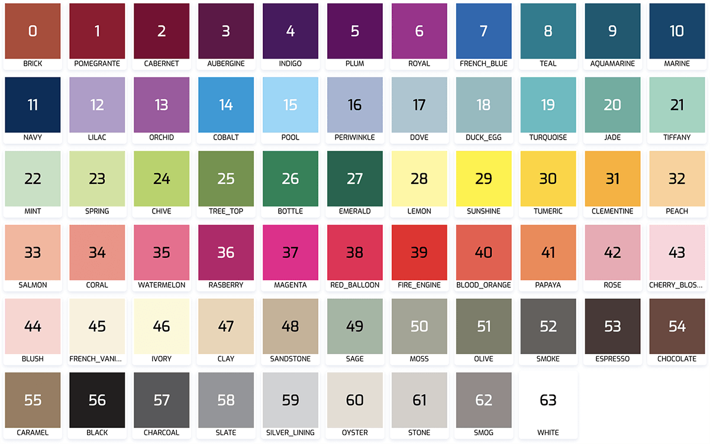

# colors

[](https://travis-ci.com/rocketbase-io/colors)
[](https://maven-badges.herokuapp.com/maven-central/io.rocketbase.commons/colors)





## usage

```java
RgbColor whiteRgb = RgbColor.readRgb("rgb( 255, 255, 255)");
RgbColor whiteHex = RgbColor.hex2rgb("#fff");
boolean textOnTopBlack = whiteHex.isBlackContrastingColor();
```
